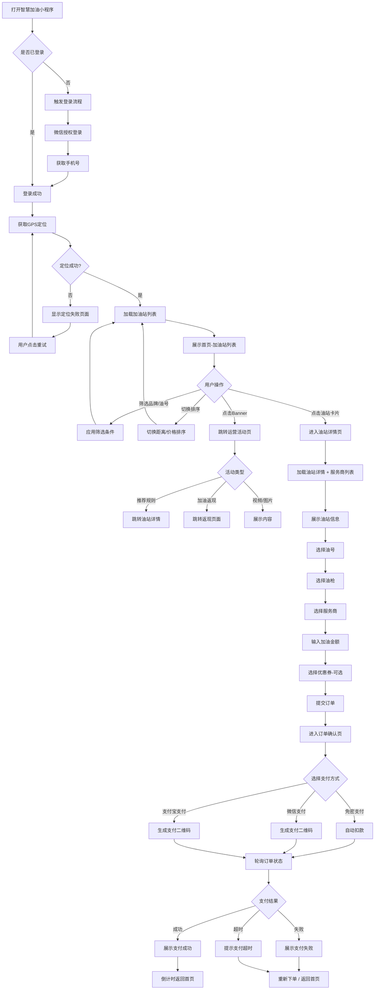
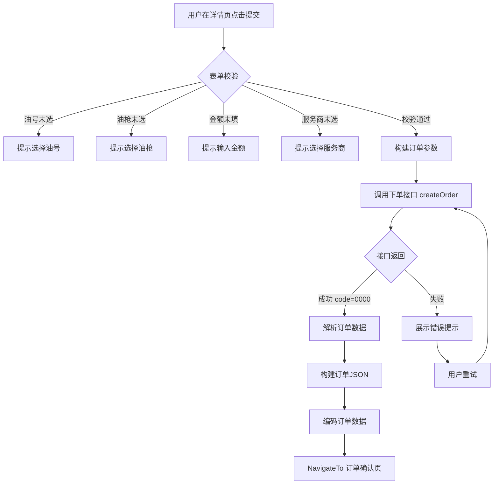
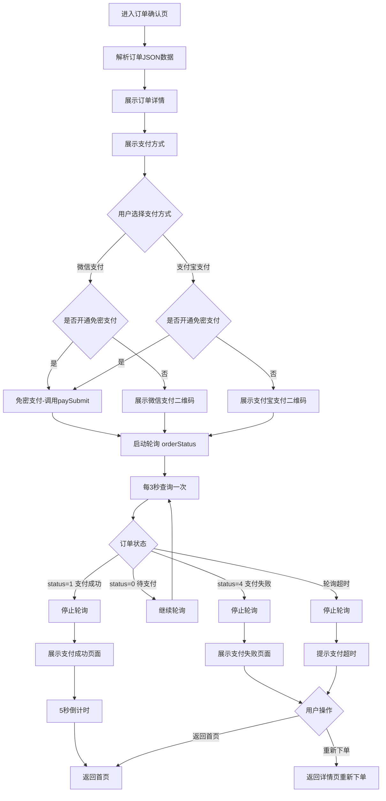
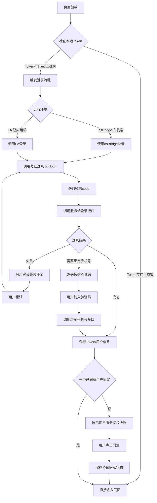
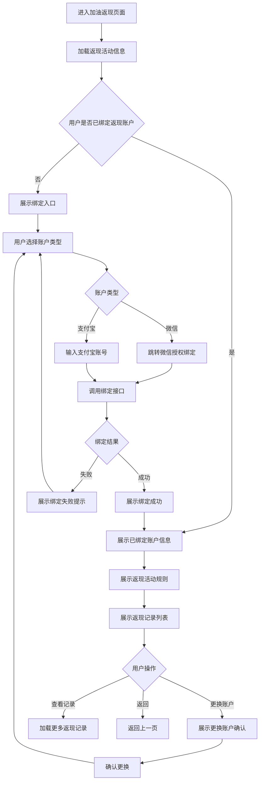
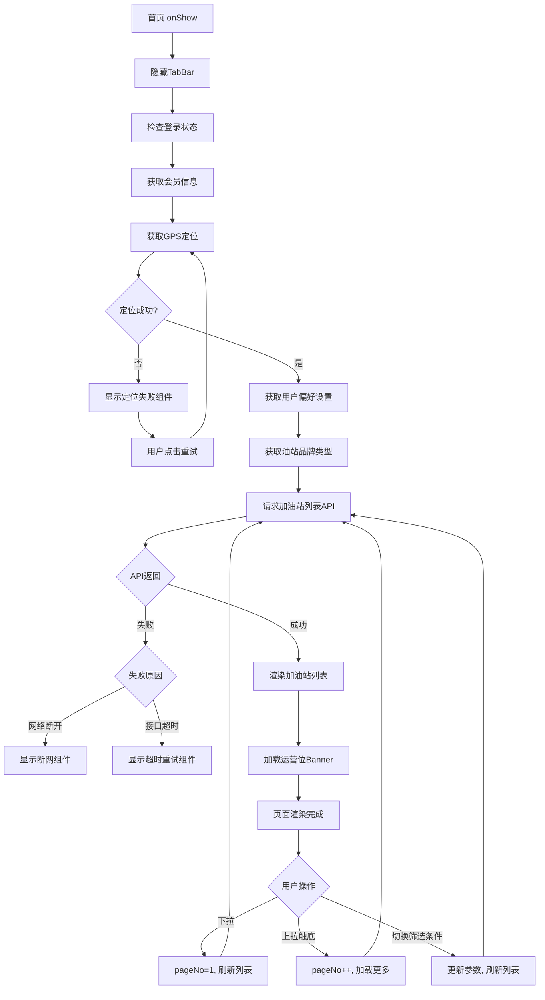
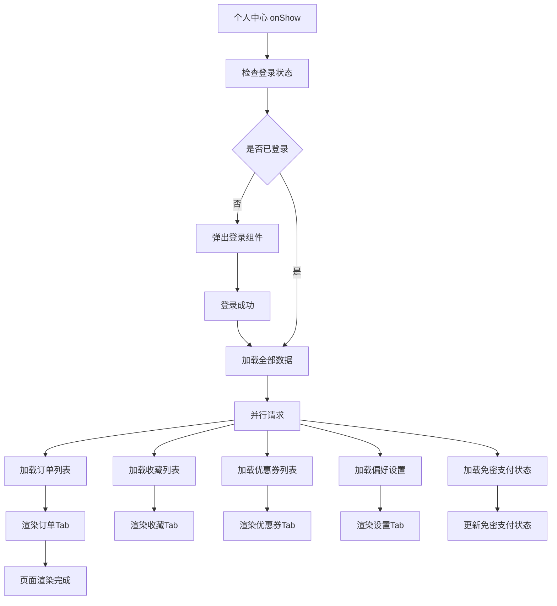
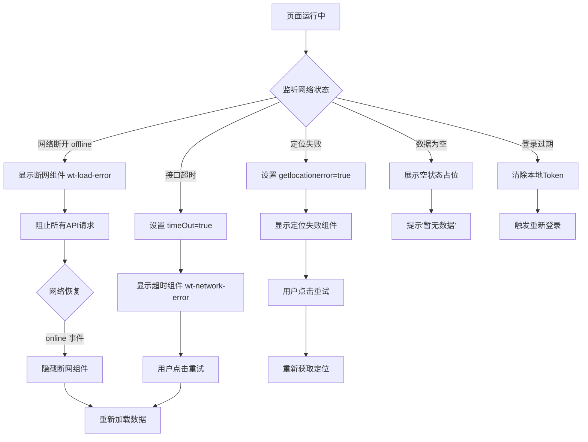
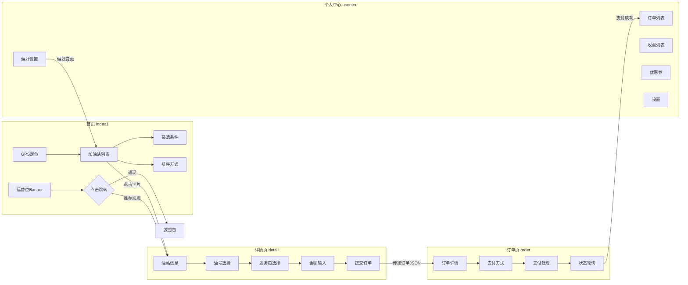
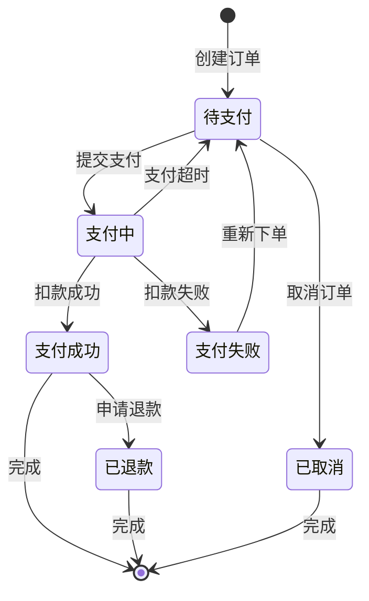

# 智慧加油小程序 - 业务流程图

> 使用 Mermaid 语法绘制 | 生成日期: 2026-08-20

---

## 1. 用户加油完整流程

---

## 2. 订单创建流程

---

## 3. 支付流程

---

## 4. 用户登录/注册流程

---

## 5. 返现领取流程

---

## 6. 首页加载流程

---

## 7. 个人中心加载流程

---

## 8. 异常处理流程

---

## 9. 组件间数据流

---

## 10. 支付状态机

